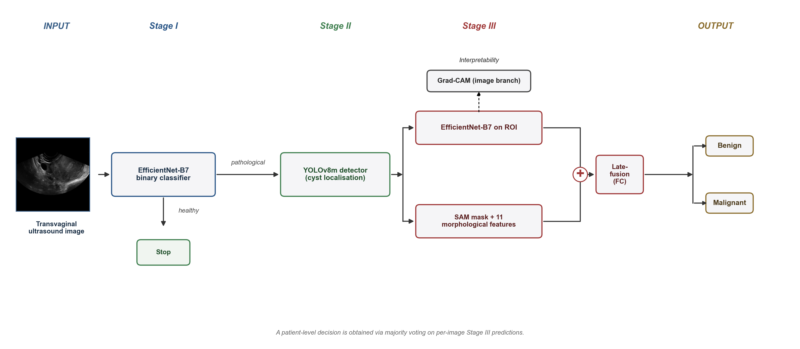
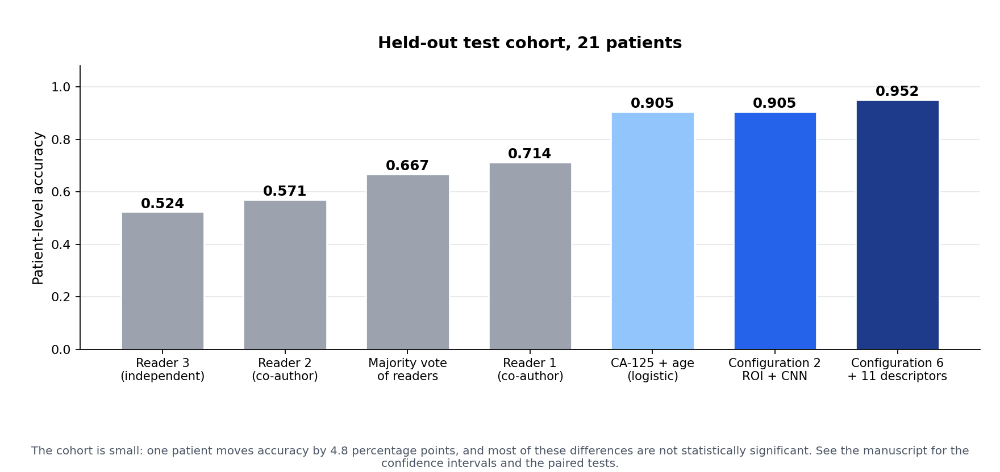
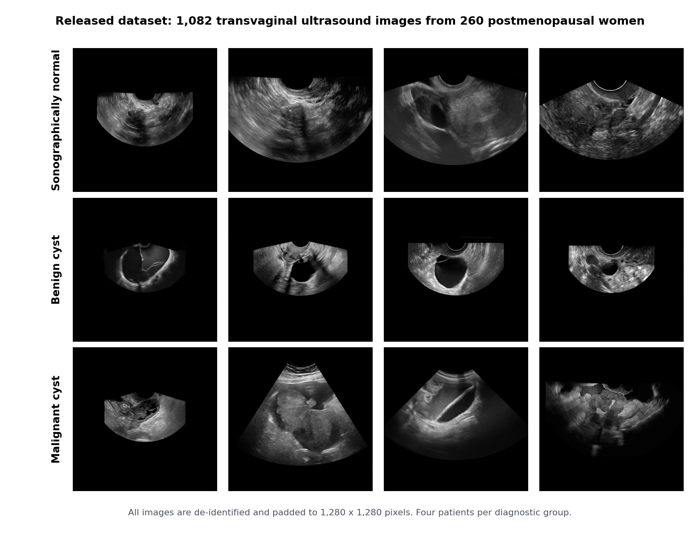
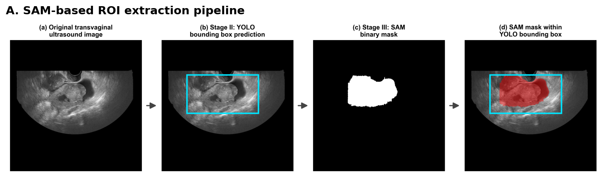
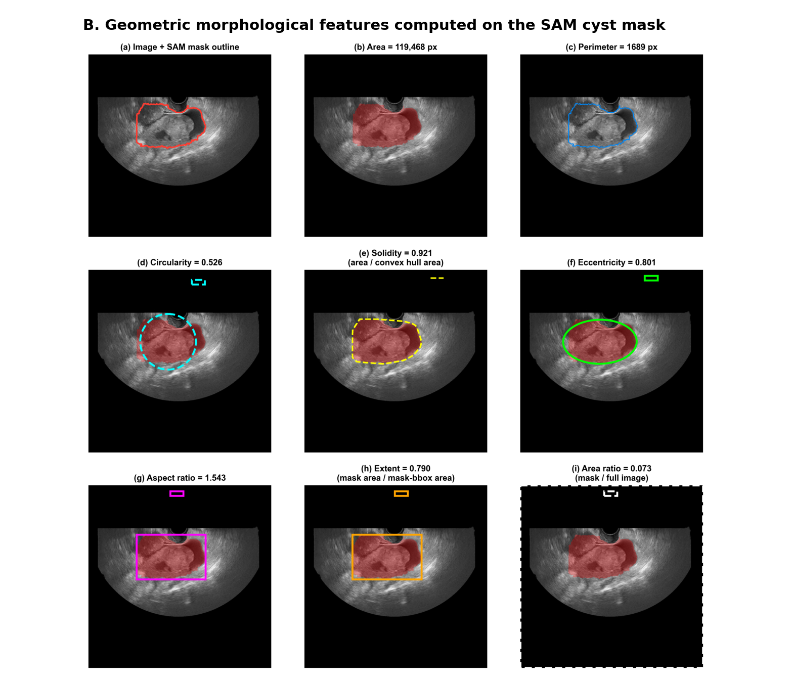

<div align="center">

# Ovarian carcinoma diagnosis from transvaginal ultrasound

**A three-stage computer-vision pipeline that reads the examination the way a gynaecologist does:
triage the frame, find the lesion, then characterise it.**

[](LICENSE)
[](https://www.python.org/downloads/)
[](https://pytorch.org/)
[](https://doi.org/10.5281/zenodo.20383744)
[](#license)

</div>



|  | Stage | Model | What it answers |
|:-:|---|---|---|
| **I** | Triage | EfficientNet-B7 with a clinical CAM-loss | Is this frame sonographically normal, or is there something there? |
| **II** | Localisation | YOLOv8m | Where is the lesion? |
| **III** | Characterisation | EfficientNet-B7 on the cropped region, fused with eleven morphological descriptors | Benign or malignant? |

A patient is called by the majority vote of their frames, ties resolved as malignant.

---

## Results



| Stage | Metric | Value |
|---|---|---|
| I, test, patient level | Accuracy / AUC | 0.974 / 0.997 |
| II, validation | mAP@0.5 | 0.746 |
| III Configuration 2, test, patient level | Accuracy / AUC | 0.905 / 0.945 |
| **III Configuration 6, test, patient level** | **Accuracy / AUC** | **0.952 / 0.964** |

Configuration 6 missed no malignant case in the reported run. The test cohort is 21 patients, so most of
these differences are not statistically significant; the manuscript gives every confidence interval and
paired test.

---

## The data



1,082 transvaginal B-mode images from 260 postmenopausal women at Meir Medical Center, 2012 to 2023,
de-identified and released under CC BY 4.0 together with the annotations, the clinical variables, the
descriptors, the partitions, the per-patient predictions and the trained weights:

**DOI [10.5281/zenodo.20383744](https://doi.org/10.5281/zenodo.20383744)** · layout in [`data/README.md`](data/README.md)

---

## How the eleven descriptors are made

O-RADS asks the reader to score what the lesion looks like: how round it is, how solid, how irregular its
wall. Stage III measures the same properties, from a mask the pipeline produces itself.



The Stage II box prompts Segment Anything, and the descriptors are computed on the resulting mask. No reader
is involved at inference time.



Two intensity descriptors (mean and standard deviation inside the mask) and local entropy complete the
eleven. SAM masks are not redistributed; they regenerate deterministically from the released boxes and the
public SAM ViT-H checkpoint.

---

## Quickstart

```bash
git clone https://github.com/Amit-Brilant/ovarian-cancer-tvus-pipeline.git
cd ovarian-cancer-tvus-pipeline
python -m venv .venv && source .venv/bin/activate
pip install -r requirements.txt && pip install -e .   # or: conda env create -f environment.yml

export OVARIAN_DATA=/path/to/unpacked_zenodo_record
export OVARIAN_WEIGHTS=/path/to/weights
export OVARIAN_RESULTS=/path/to/results

python scripts/evaluate_stage3.py --configuration 6
```

<details>
<summary><b>The command for each stage and analysis in the paper</b></summary>

| Paper object | Command |
|---|---|
| Stage I evaluation with the released model | `python scripts/evaluate_stage1.py` |
| Stage I training (clinical CAM-loss) | `python scripts/train_stage1.py` |
| Stage II detector | `python scripts/prepare_yolo_dataset.py`, `python scripts/train_stage2.py`, `python scripts/evaluate_stage2.py` |
| SAM masks and the eleven descriptors | `python scripts/make_sam_masks.py`, `python scripts/extract_features.py` |
| Clinical pre-classifier, SHAP and PCA | `python scripts/train_clinical_xgboost.py` |
| Stage III training | `python scripts/train_stage3.py --configuration 6` |
| Stage III evaluation, with the aggregation rules of Supplementary Table S5 | `python scripts/evaluate_stage3.py --configuration 6 --aggregation-rules` |
| Readers, clinical baselines, calibration, descriptor importance and robustness, Stage I variability | `python -m analysis.run_all` (see [`analysis/README.md`](analysis/README.md)) |
| Grad-CAM | the [`grad-cam`](https://github.com/jacobgil/pytorch-grad-cam) library on the last convolutional layer of the EfficientNet-B7 backbone |

Every script accepts `--help`. No seed value is stored in the code: scripts that use randomness take `--seed`
or read the `SEED` environment variable, and stop if neither is given.

</details>

<details>
<summary><b>Repository layout</b></summary>

```
ovarian/                    paths, data tables, models, clinical CAM-loss, Stage I, Stage III,
                            segmentation, descriptors, clinical models, statistics
scripts/                    one entry point per step
analysis/                   the statistical analyses reported in the paper
tests/                      unit tests (pytest)
stage1_clinical_cam_loss/   the Stage I trainer exactly as it was run
docs/                       the figures on this page
data/README.md              data layout, cohort, partitions, clinical variables
```

`ovarian/` and `scripts/` are a reimplementation of the experiments as one package, so the pipeline runs end
to end from the public release. Every number it produces was checked against the corresponding published
result: the Stage I predictions, the Configuration 2 and Configuration 6 validation and test metrics,
Supplementary Table S5, and every analysis in `analysis/`.

</details>

---

## Limitations

- Single-centre cohort. Multi-centre external validation is the highest-priority follow-up.
- 21 test patients for Stage III. One patient moves patient-level accuracy by 4.8 percentage points.
- Three-reader benchmark on those 21 patients; two of the three readers are co-authors.
- Stage I separation may partly reflect acquisition differences between the normal and pathological groups,
  and should not be read as a screening result.
- Postmenopausal women only. No physical-scale calibration, so the geometric descriptors are relative within
  this cohort. Doppler vascularity is not modelled.

**This software is for research and education only. It is NOT a clinical device.**

---

## Authors

Omer Aviv, Amit Brilant, Oshrit Hoffer, Omer Vetcher, Shai Yitzhak, Nagham Ghanayem, Ofer Markovitch and
Ofer Hadar.

## Citation

```bibtex
@article{Brilant2026OvarianTVUS,
  title   = {Three-stage computer-vision pipeline for ovarian carcinoma diagnosis from transvaginal
             ultrasound in postmenopausal women},
  author  = {Aviv, Omer and Brilant, Amit and Hoffer, Oshrit and Vetcher, Omer and Yitzhak, Shai and
             Ghanayem, Nagham and Markovitch, Ofer and Hadar, Ofer},
  journal = {PLOS Digital Health (under revision)},
  year    = {2026}
}
```

Software metadata is in [`CITATION.cff`](CITATION.cff).

## License

Source code: [MIT](LICENSE). Dataset and weights: CC BY 4.0, via Zenodo.
